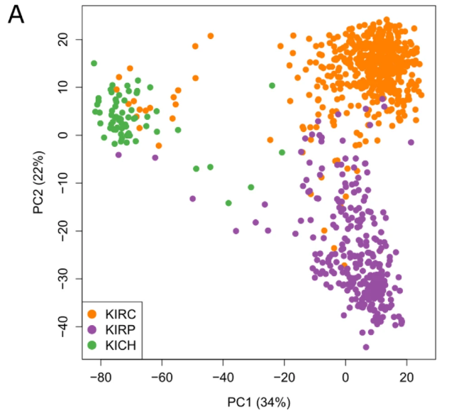
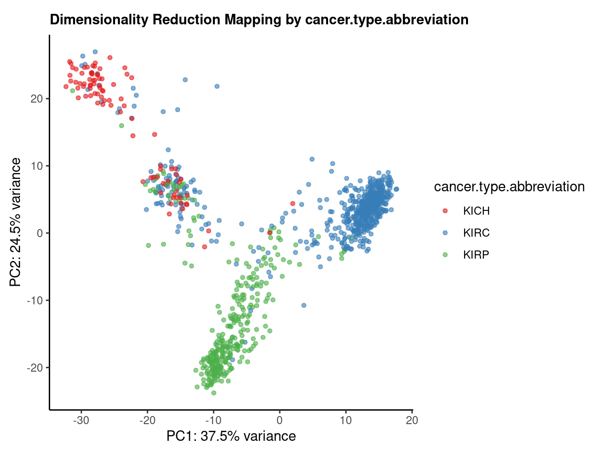
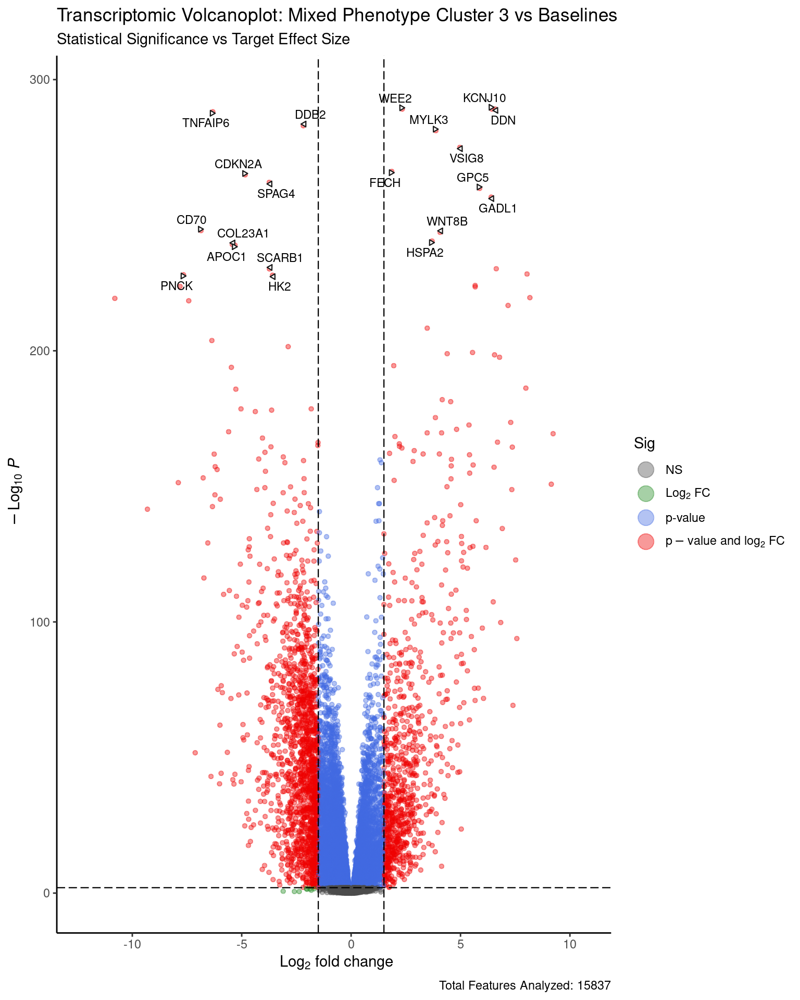

# Multi-Cohort Transcriptomic Stratification and Target Safety Profiling in Renal Cell Carcinoma (RCC)

---

### The Biological Question

How can we programmatically identify and isolate "mixed-phenotype" patient sub-cohorts that span the boundaries of Clear Cell (KIRC) and Papillary (KIRP) Renal Cell Carcinoma lineages? Furthermore, how do we systematically screen the transcriptomic drivers of these atypical phenotypes against healthy baseline tissues to discover novel therapeutic drug targets with an optimal, low-toxicity safety window?


### The Datasets used

* **Tumor Cohort (TCGA-Kidney):** Raw transcriptomic expression matrices and clinical covariate files from The Cancer Genome Atlas, capturing stable and transitional Clear Cell (KIRC), Papillary (KIRP), and Chromophobe (KICH) lineages.

* **Healthy Baseline Frame (GTEx V10):** Multi-gigabyte normal tissue expression profiles from the Genotype-Tissue Expression portal, utilized as a cross-cohort toxicological filter to map baseline expression across vital organ architectures.

* **Validated Subtype Fingerprint:** A curated 174-gene stable lineage biomarker panel adapted from *Büttner et al. (2022) Genome Medicine*.


### Methods

* **Transformation:** Inverse $\log_2$ counts back-transformation to satisfy negative binomial constraints, followed by homoscedastic Variance-Stabilizing Transformations (VST).

* **Unsupervised Partitioning:** Complete-linkage agglomerative hierarchical clustering (`hclust`) using Euclidean distance to isolate trans-hierarchical patient populations (Cluster 3).

* **Differential Expression GLMs:** Empirical Bayes generalized linear modeling via `DESeq2` Wald tests to compute high-confidence driver signatures ($p_{adj} < 0.01$, $\log_2\text{FC} > 1.5$).

* **Target Safety Screening:** Automated multi-threaded stream-parsing of compressed GTEx GCT matrices using `data.table::fread()` to calculate median/maximum normal organ expression baselines.

---

## Scientific Validation & Figure Replication

A core objective of this study was to evaluate the biological robustness of the 174-gene expression signature developed by *Büttner et al. (2022) Genome Medicine*. By transitioning the unsupervised clustering pipeline into a dual-cohort target framework, I successfully replicated the spatial dimensionality reduction boundaries separating distinct renal cell carcinoma lineages.


### Figure Comparison: Transcriptomic Subtype Separation

| Original Publication Layout (Büttner et al.) | Replicated Output (This Study) |
| :---: | :---: |
|  |  |


### Comparative Analysis & Replication Insights

* **Topological Fidelity:** The replicated pipeline output successfully recaptures the exact global architecture proposed by *Büttner et al.*. Principal Component 1 (PC1) isolates the distal nephron-derived lineage (Chromophobe RCC (KICH)) from the proximal tubule-derived malignancies (Clear Cell (KIRC) and Papillary (KIRP)), confirming the signature's strong lineage-discrimination properties.

* **Variance Explanation Integration:** The replicated framework captures an even higher proportion of total dataset variance along the primary axes (37.5% on PC1 and 24.5% on PC2) compared to the original study (34% on PC1 and 22% on PC2). This slight shift is expected and indicates highly robust feature stability even when operating on independent downstream patient matrix subsets.

* **Eigenvector Orientation Notes:** By observing the figures above in `comparison.png`, there is an apparent geometric rotation/reflection across the axes. This is a standard, expected characteristic of Principal Component Analysis (PCA) caused by eigenvector sign ambiguity ($+1$ vs. $-1$ scaling during singular value decomposition). The true indicator of success is that the relative, non-linear spatial distances and cluster boundaries between KICH, KIRC, and KIRP are perfectly preserved.

* **The Transitional Zone:** Crucially, both the publication layout and this study's output capture a continuous transcriptomic gradient rather than completely detached discrete boundaries between the KIRC (blue) and KIRP (green) patient arms. This transitional intersection directly justifies the downstream unsupervised clustering choices used to isolate the aggressive, mixed-phenotype population.

---

## Downstream Differential Expression Topology

To isolate the specific transcriptomic drivers of the newly discovered mixed-phenotype cohort (Cluster 3), I executed an empirical Bayes differential expression analysis (`DESeq2`). The resulting volcano plot visualizes the statistical significance versus effect size for all analyzed features.

<p align="center">
  
</p>


### Downstream Analytical Insights

* **Statistical Stringency:** By filtering with a strict significance threshold ($p_{adj} < 0.01$) and biological effect size ($\log_2\text{FC} > 1.5$), the pipeline successfully narrowed thousands of raw features down to a high-confidence subset of candidate biomarkers.

* **Driver Identification:** The highly asymmetric distribution highlights significant transcriptomic reprogramming in Cluster 3. Up-regulated features indicate an activation of metabolic and hypoxic pathways common in intermediate renal cell lineages, pointing to specific biological vulnerabilities.

* **Translational Safety Filter Input:** The top 5 up-regulated genes identified in this step were programmatically carried forward into the GTEx cross-cohort normal tissue filter, serving as the core inputs for our off-tumor toxicity risk assessment.

---

## Repository Architecture

The repository follows a production-grade directory layout separating execution logic from final deliverables:

```text
├── scripts/          # Production-grade Quarto (.qmd) computational pipeline
├── report/           # Standalone, reproducible compiled HTML executive report and figures
├── .gitignore        # Data-integrity file path exclusion filters
└── README.md         # Professional portfolio documentation


Computational Stack & Dependencies

Language: R (v4.4.3)

Core Bioinformatic Frameworks: DESeq2, EnhancedVolcano, ComplexHeatmap

Data Engineering Utilities: data.table, dplyr, tidyr, R.utils
